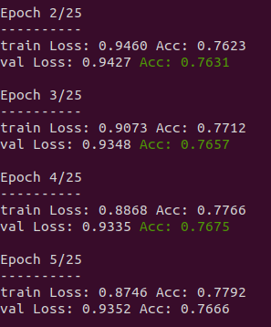
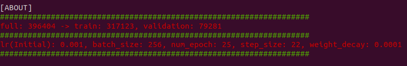

# ImageNet-1k_finetuned_311classes
## Abstract
change the fc layer of the model pre-trained by ImageNet-1k from 1000 classes to 311 classes using finetuing.
I used this website(pytorch tutorial) as a reference.  
This script is based on https://pytorch.org/tutorials/beginner/transfer_learning_tutorial.html  

## Using dataset
I use ILSVRC2012 downloading from URL: https://www.kaggle.com/c/imagenet-object-localization-challenge
  

## About finetuning
I finetuned from 1000 to 311classes exsisting indoor situation. Choosed class's detail is written to "myclass.txt". Please check it.  

## sample script
- ***train.py***  
 You have to specify the number of batches, learning rate, number of epochs, and cuda number as arguments when executing.  
```
python3 train.py [batch_size] [learning_rate] [epochs] [cuda_number]
```

- ***train_aug.py***  
 You have to specify the number of batches, learning rate, number of epochs, and cuda number as arguments when executing.  
```
python3 train_aug.py [batch_size] [learning_rate] [epochs] [cuda_number]
```
- ***inference_resnet.py***  
 You have to specify model_path finetuned as arguments when executing.
```
python3 inference.py [model_path] [number_of_layer] [image_directory_path]
```

## Examples of progress
 You run train_xx.py, Progress is displayed like example images.  
  
  


TBA...
